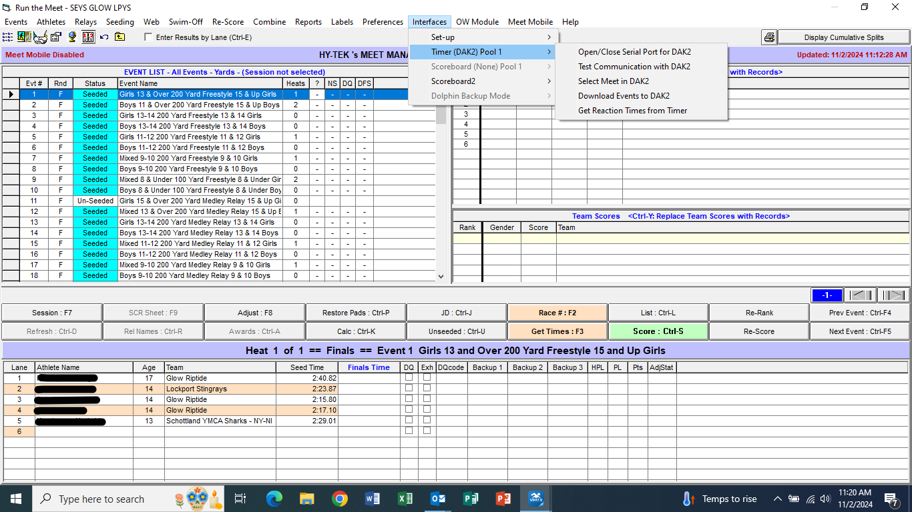
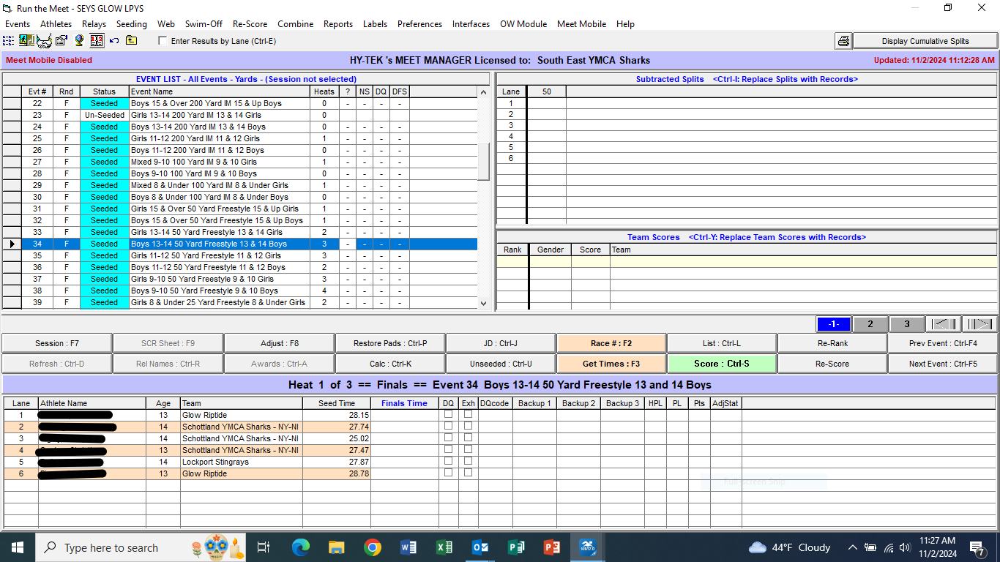

## Equipment 

 -  Computer with Meet Manager software, attached to score console
 -  Mouse/keypad (optional)
 -  Meet program labeled 'Score Table'
 -  Completed lane timer sheets
 -  Completed DQ sheets from deck officials
 -  Lineup adjustment forms from coaches 

## Meet Operations 
### Download Events to Console 
Prior to the start of the first race, the events from Meet Manager need to be downloaded to the Daktronics console.   This only needs to be done once, and will set the proper length for each event in the timing system.

### Get Times for Event/Heat 
After every race, times need to be retrieved from the scoring system.   This can be done asynchronously, but should be done periodically to keep the computer data up-to-date.   

This can be done by clicking the 'Get Times' button in the heat screen, or by hitting the F3 key.  You will need to click on the Heat number to select the proper race.

### Manually Entering 25 yard Event Times 

### Entering DQ Sheets 

### Reset Board to Middle School Events 

 
