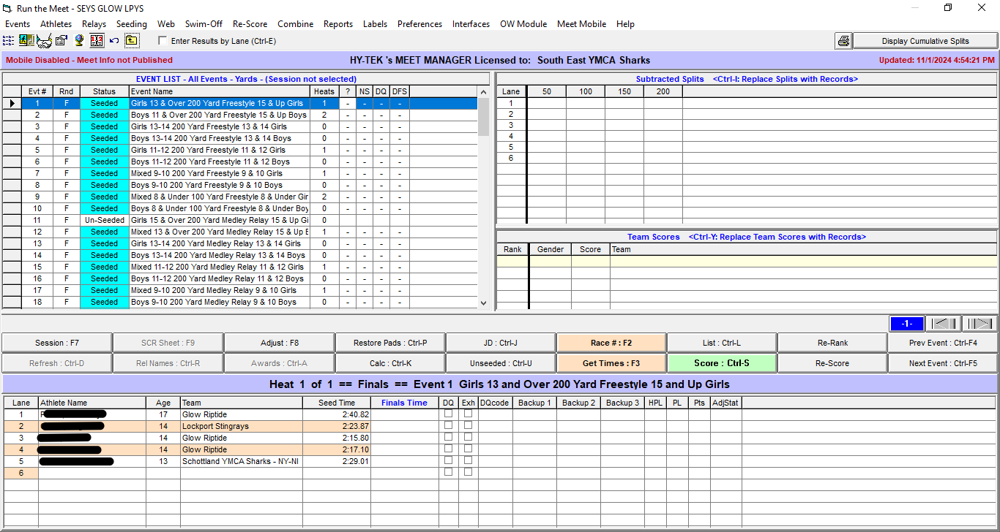

## Equipment 

 -  Computer with Meet Manager software, attached to score console
 -  Mouse/keypad (optional)
 -  Meet program labeled 'Score Table'
 -  Completed lane timer sheets
 -  Completed DQ sheets from deck officials
 -  Lineup adjustment forms from coaches 

## Meet Operations 
### Download Events to Console 

### Get Times for Event/Heat 

### Manually Entering 25 yard Event Times 

### Entering DQ Sheets 

### Reset Board to Middle School Events 

 
