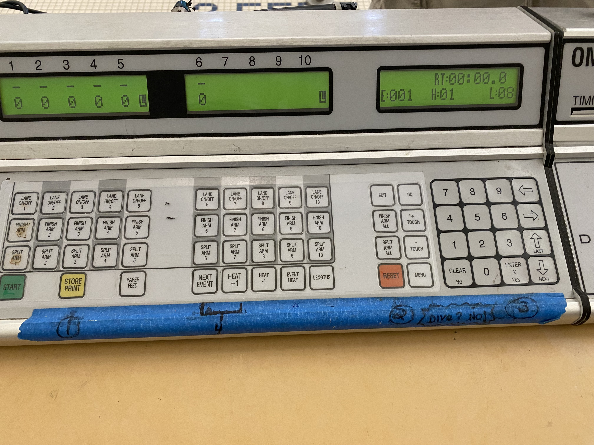

## Advanced Tasks

### Turning off unused lanes
When a race is underway, and not all lanes have a swimmer, it is helpful to turn off the scoring system for those lanes.  This prevents extra data from being sent to the computer, limits paper usage, and makes the scoreboard easier to read during the race.

Each lane (1-6) has a button labeled 'Lane On/Off #' - you can push this once to disable that lane from recording a time.   If this is pushed by mistake (for example, you didn't see a swimmer in a lane), simply press it again to enable that lane.   It does not impact the overall time for the event.

### Adjusting event/heat number manually
If the console needs to be set manually for an event or heat number, use the 'Event Heat' button.  Use the number pad to enter the proper race number and heat, pressing 'Enter' after each.

This can happen if during the operation of the board, the 'Next Event' button is pushed too many times, and the console needs to be set to a lower number.

### Missed split touch
During longer events, it is possible that swimmers either miss the pad on a turn, or the system doesn't register a touch properly. In order to record split times within the system, you can use the 'Touch +' button, and then enter the lane number.   This will increment the count of lengths in that lane.

This is not required, as long as the 'Finsh Arm #' is pressed prior to the swimmer hitting the pad on their final approach.   This will ensure a final time is recorded by the system.

