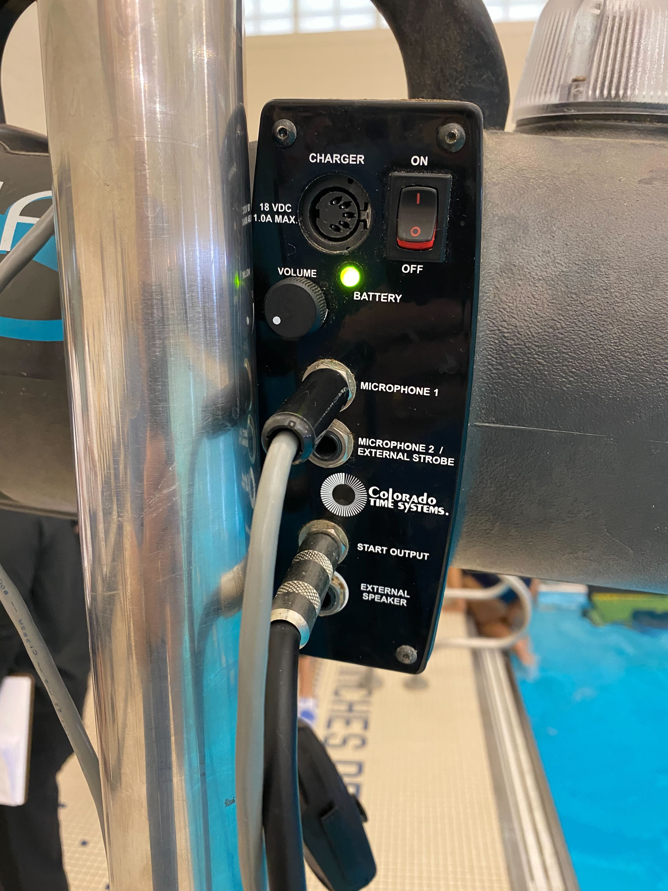
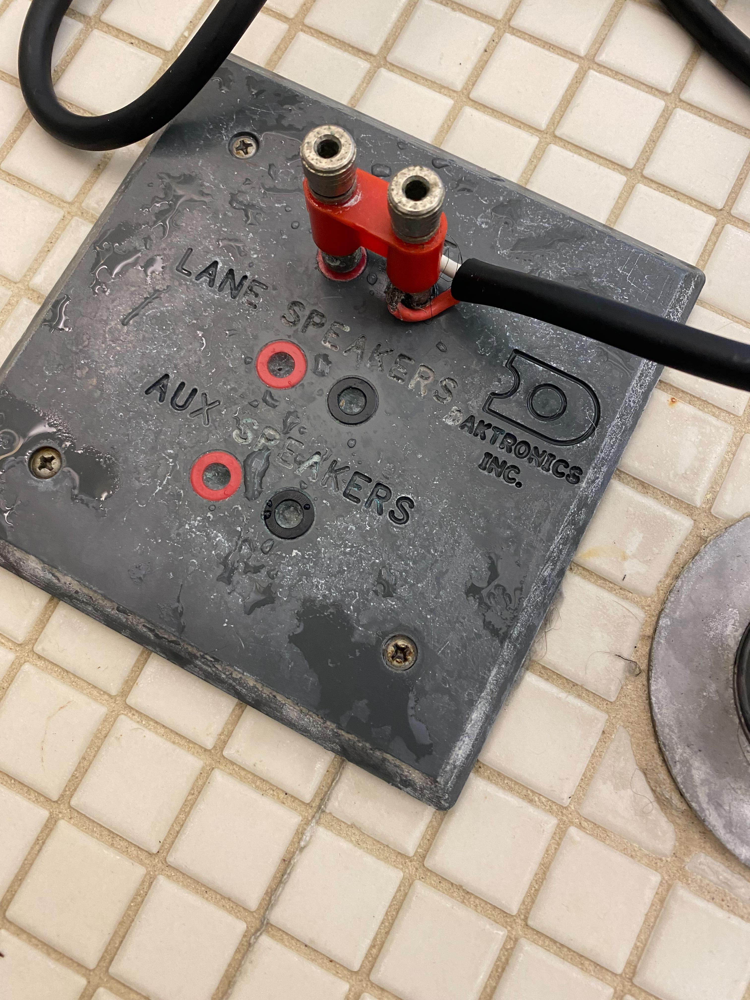
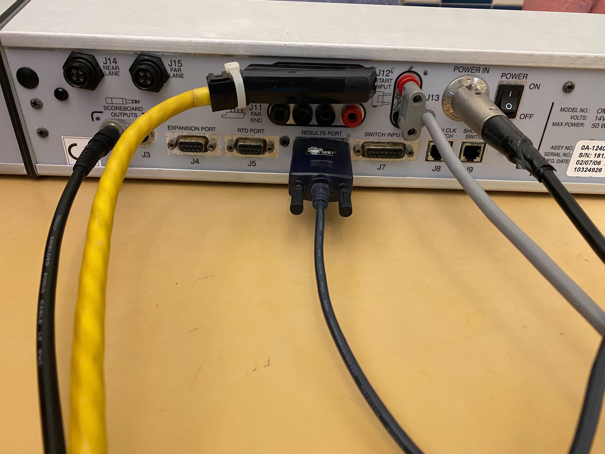
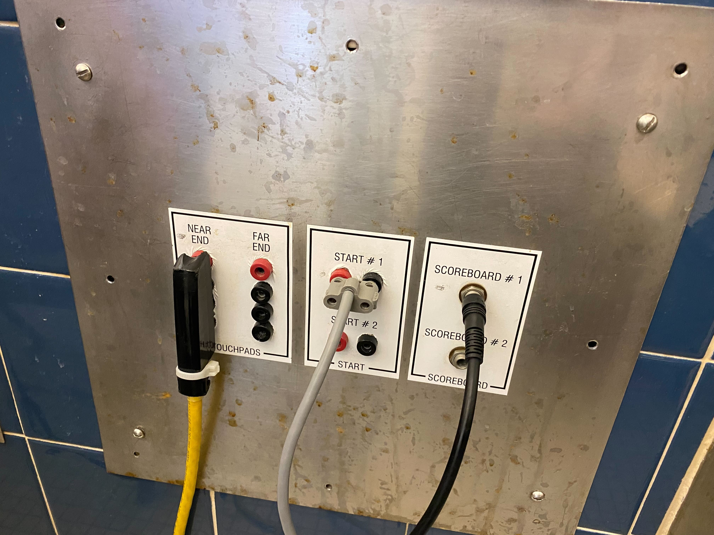

## Equipment 
- 6 lane pads with connection cables (attached)
- 6 plungers 
- Timing speaker/strobe light unit with microphone (owned by Sharks)
- Daktronics console
- Power and connection cables for console (provided by school, on cart)

## Lane Setup
- Raise diving board to elevated position
- Hang one touch pad in each swim lane, and connect cable to floor port.  __Note__: the black side of the connector has the tab, it goes into the black port on the floor
- Connect one button/plunger to each lane, in the Button 1 port.  Again, black to black

## Starting Unit Setup
- Clip two red straps to loop on 5 yard flag pole.  Orient speaker towards swimmers and spectators.
- Attach microphone hand unit to Microphone 1 port.  The speaker unit has a metal clip to hang the mic when not actively being used.
- Attach 1/4" to 2 prong cable from 'Start Output' on unit to 'Start' on floor panel.

## Console Setup
- Daktronics console is stored on rolling cart in storage area of pool.
- Connect power to wall outlet and 'Power In' on console. 
- Connect yellow four prong connector from wall panel 'Near End' to console 'Near End'
- Connect two prong cable from wall panel 'Start #1' to 'Start Input' on console.  Black connector has tab.
- Connect 1/4" - 1/4" cable from wall panel 'Scoreboard #1' to J2 Scoreboard Output on console
- Turn console on with power toggle switch

## Verify All Equipment Functionality
- During warm-ups, verify that all aspects of the timing system function properly
  - Scoreboard display works and shows event/lane times while running
  - Microphone and starter work, incluing triggering the timing system, strobe light and buzzer
  - Test each touch pad for functionality.  Verify plug is oriented properly in floor panel port.
  - Reset the console board as needed during testing.  Ensure that the proper starting event number is active before first event.
